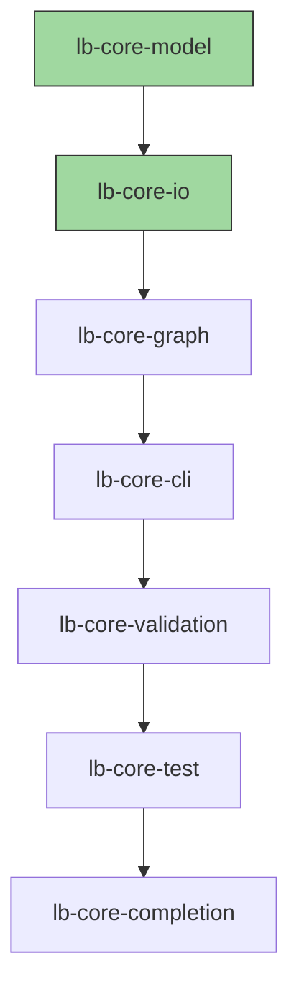

# lattice-base

A lightweight, testable project-lattice framework for organizing and validating development tasks, dependencies, and tests.  
Developed and maintained by **Robert Law <nosimpler@gmail.com>**.  
Licensed under **LGPL-3.0**.

---

## 🧩 Overview

`lattice-base` provides a minimal YAML-backed project lattice model.  
It lets you treat a software or research project as a directed acyclic graph (DAG) of tasks — each with dependencies, tests, and states.

**Key features:**
- Tasks form a dependency lattice.
- `lattice-base-test --complete` runs all testable tasks, updating statuses.
- `lattice-base-mermaid` generates live diagrams (for GitHub or CI visibility).
- Designed for modular integration with higher-level orchestration tools.

---

## ⚙️ Quickstart (for your project)

### Linux / macOS

```bash
# From your project repo root
python3 -m venv .venv
source .venv/bin/activate

pip install --upgrade pip
pip install "lattice-base @ git+https://github.com/your-user/lattice-base.git"

# Initialize, validate, and test
lattice-base-init --repo . --id myproj --name "My Project"
lattice-base-next --repo .
lattice-base-validate --repo .
lattice-base-test --complete
lattice-base-mermaid --repo . > lattice.mmd
```

### Windows (PowerShell)

```powershell
# From your project repo root
py -m venv .venv
.\.venv\Scripts\Activate.ps1

pip install --upgrade pip
pip install "lattice-base @ git+https://github.com/your-user/lattice-base.git"

# Initialize, validate, and test
lattice-base-init --repo . --id myproj --name "My Project"
lattice-base-next --repo .
lattice-base-validate --repo .
lattice-base-test --complete
lattice-base-mermaid --repo . > lattice.mmd
```

> ⚠️ **Troubleshooting (Windows execution policy)**  
> If PowerShell refuses to run the activation script due to execution policy, temporarily relax it for this session only:
> ```powershell
> Set-ExecutionPolicy -ExecutionPolicy Bypass -Scope Process -Force
> ```

---

## ⚡️ Optional Bootstrap Scripts

If you prefer a single command to set everything up, you can use the provided bootstrap scripts:

### Windows

```powershell
# From your project repo root (only do this if you trust the script)
powershell -ExecutionPolicy Bypass -File .\scripts\bootstrap_windows.ps1
```

### Linux / macOS

```bash
bash scripts/bootstrap_unix.sh
```

Both scripts will:
- Create a venv
- Install `lattice-base`
- Initialize and validate a lattice
- Run `lattice-base-test --complete`
- Generate a `lattice.mmd` diagram

---

## 🧠 Developing lattice-base itself

If you want to work on lattice-base itself:

### Linux / macOS

```bash
python3 -m venv .venv
source .venv/bin/activate

pip install --upgrade pip
pip install -e .[dev]

pytest
lattice-base-test --complete
```

### Windows

```powershell
py -m venv .venv
.\.venv\Scripts\Activate.ps1

pip install --upgrade pip
pip install -e .[dev]

pytest
lattice-base-test --complete
```

---

## 📈 Example: lattice-base project lattice



You can generate this diagram automatically for your project:
```bash
lattice-base-mermaid --repo . > lattice.mmd
```

---

## 🧪 Testing

Run all tests:

```bash
pytest
lattice-base-test --complete
```

The latter will execute all CLI-defined task tests from your `project.yaml` and mark tasks as done or revert them as needed.

---

## 📜 License

LGPL-3.0 © 2025 Robert Law <nosimpler@gmail.com>
